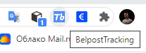
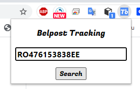
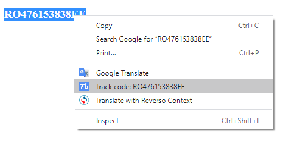

# Belpost Tracking Tool
 

  

  <h3 align="center">BelpostTracking - Chrome Extension for tracking parcels via belpost.by</h3>
  

    Based on pure JavaScript.
     
    <a href="https://github.com/StasAndreich/BelpostTracking"><strong>Source code »</strong></a>
  

 

  
Table of Contents

  <ol>
    <li>
      <a href="#about">About</a>
    </li>
    <li>
      <a href="#features">Features</a>
      <ul>
        <li><a href="#pop-up-window">Pop-up window</a></li>
        <li><a href="#context-menu">Context menu</a></li>
      </ul>
    </li>
    <li><a href="#how-to-install">How to install</a></li>
  </ol>

## About
This extension is about to reduce the amount of steps needed to check your parcel status on
[belpost.by](https://belpost.by/Otsleditotpravleniye?number=) using a ***track code***.

 

## Features
#### Pop-up window
You can pin this extension to Chrome browser extension bar. By clicking on it you can put a ***track code*** 
rigth into the input field and then submit it.
This operation leads to opening a new tab with the tracking info.

 

#### Context menu
Using a *Context Menu feature* you can simply highlight a ***track code***, right-click and proceed to the tracking page.

 

## How to install
To install this extension you may follow [this instruction](https://webkul.com/blog/how-to-install-the-unpacked-extension-in-chrome/).
